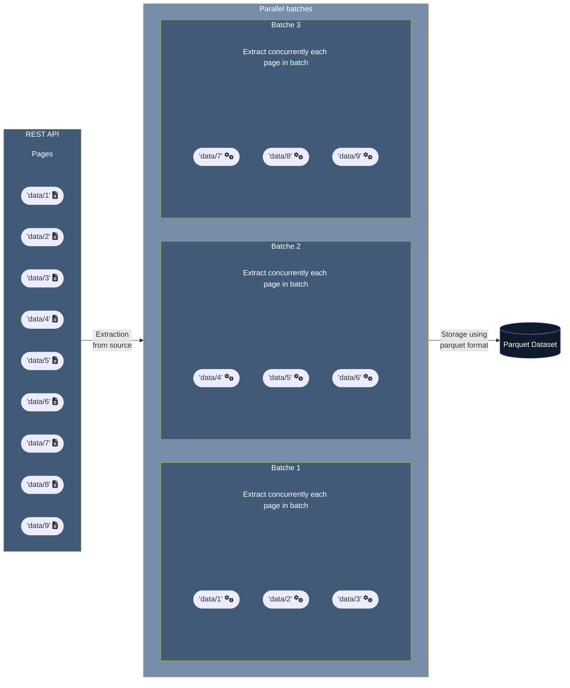

# Guinna

A tool for easily extracting data from paginated endpoints of a REST API.

> **Note:** This project is still in the early stages of development.

## Architecture

```mermaid
flowchart LR
    classDef blue1 fill:#0D1B2A, color:#fff
    classDef blue2 fill:#1B263B, color:#fff
    classDef blue3 fill:#415A77, color:#fff
    classDef blue4 fill:#778DA9, color:#fff
    classDef blue5 fill:#E0E1DD, color:#000
    classDef title color:#000, stroke-width:0px, font-size: 15px, font-weight: bold
    classDef borderless stroke-width:0px

    subgraph api[REST API]
        direction LR
        pages[[Pages]]
        A1(['data/1' fa:fa-file-text])
        A2(['data/2' fa:fa-file-text])
        A3(['data/3' fa:fa-file-text])
        A4(['data/4' fa:fa-file-text])
        A5(['data/5' fa:fa-file-text])
        A6(['data/6' fa:fa-file-text])
        A7(['data/7' fa:fa-file-text])
        A8(['data/8' fa:fa-file-text])
        A9(['data/9' fa:fa-file-text])
    end

    subgraph batches[Parallel batches]
        direction LR

        subgraph batch1[Batche 1]
            direction TB
            E1[[Extract concurrently each page in batch]]
            subgraph bs1[ ]
                direction TB
                A1_(['data/1' fa:fa-cogs])
                A2_(['data/2' fa:fa-cogs])
                A3_(['data/3' fa:fa-cogs])
            end
            E1 ~~~ bs1
        end

        subgraph batch2[Batche 2]
            direction TB
            E2[[Extract concurrently each page in batch]]
            subgraph bs2[ ]
                direction TB
                A4_(['data/4' fa:fa-cogs])
                A5_(['data/5' fa:fa-cogs])
                A6_(['data/6' fa:fa-cogs])
            end
            E2 ~~~ bs2
        end

        subgraph batch3[Batche 3]
            direction TB
            E3[[Extract concurrently each page in batch]]
            subgraph bs3[ ]
                direction TB
                A7_(['data/7' fa:fa-cogs])
                A8_(['data/8' fa:fa-cogs])
                A9_(['data/9' fa:fa-cogs])
            end
            E3 ~~~ bs3
        end
    end

    dataset[(Parquet Dataset)]

    api--"Extraction<br/>from source"-->batches--"Storage using<br/>parquet format"-->dataset

    class batches_ title

    class bs1,E1 borderless
    class batch1,bs1,E1 blue3

    class bs2,E2 borderless
    class batch2,bs2,E2 blue3

    class bs3,E3 borderless
    class batch3,bs3,E3 blue3

    class api,pages blue3
    class batches,batches_ blue4

    class batches_ borderless
    class A1,A2,A3,A4,A5,A6,A7,A8,A9,A10,pages borderless
    class A1_,A2_,A3_,A4_,A5_,A6_,A7_,A8_,A9_,A10_ borderless
    class dataset blue1
```
